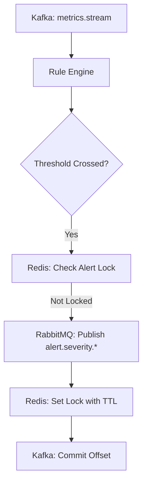

# Service Documentation: Infra Alert Engine (infra-alert-engine-service)

This service is the reliability intelligence core of InfraOS, responsible for transforming raw telemetry events into actionable infrastructure alerts via a sophisticated rule evaluation and deduplication pipeline.

## 1. Folder Structure
```text
services/infra-alert-engine/
├── app/
│   ├── api/v1/         # Rule Management APIs
│   ├── clients/        # Kafka Consumer & RabbitMQ Dispatcher
│   ├── engines/        # Rule Logic & Redis Lock Manager
│   ├── schemas/        # Alert & Rule Pydantic Models
│   ├── services/       # Central processing logic
│   └── main.py         # Entry Point
├── Dockerfile          # Image Specification
└── requirements.txt    # Python Dependencies
```

## 2. Kafka Consumer Architecture
The engine uses a non-blocking `aiokafka` consumer assigned to the `infra-alert-engine` group.
- **Topic:** `infra.metrics.stream`
- **Safety:** Implements manual offset commits only after successful alert processing/suppression to ensure zero-loss reliability.

## 3. Rule Engine Design
The engine supports a programmable rule set:
- **Threshold Rules:** Simple `metric > threshold` logic (e.g., Temperature, Power).
- **Composite Rules:** (Ready for expansion) Multi-condition logic across different metrics.
- **Dynamic Rules:** New rules can be injected at runtime via the REST API without service restarts.

## 4. Redis Locking & Storm Prevention
To prevent "alert storms" (sending thousands of duplicate alerts for a single sustained failure), the engine implements a distributed lock strategy:
- **Lock Key:** `alert_lock:{tenant_id}:{entity_id}:{rule_id}`
- **TTL:** Defaults to 60 seconds (Configurable per rule).
- **Logic:** If a lock exists in Redis for a specific alert context, the incoming event is discarded (suppressed).

## 5. RabbitMQ Publishing Model
Alerts are broadcasted to the `infra.alerts` topic exchange on the command bus.
- **Severity Routing:** Alerts are routed to `alert.warning.*` or `alert.critical.*` keys.
- **Downstream Actions:** Integrated services (Ticketing, Auto-healing, Notifications) can bind to these specific keys.

## 6. Alert Event Schema (v1)
```json
{
  "version": "v1",
  "timestamp": 1710000000,
  "tenant_id": "T1",
  "severity": "CRITICAL",
  "rule_id": "THERMAL_CRITICAL",
  "metric_name": "rack_temp_c",
  "metric_value": 47.2,
  "description": "Rack temperature exceeded 45C critical threshold"
}
```

## 7. Async Processing Flow

