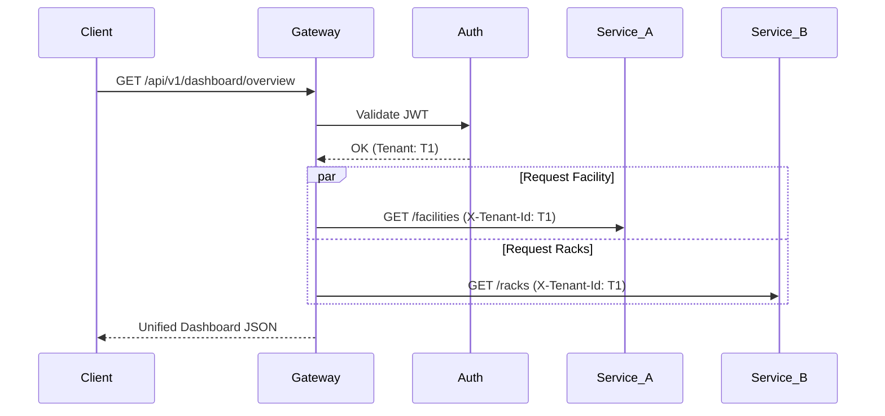

# Service Documentation: InfraOS API Gateway (gateway-service)

The API Gateway is the unified entry point and orchestration layer for the InfraOS platform. It manages external traffic, enforces security, and provides high-level abstractions for UI clients.

## 1. Folder Structure
```text
services/infra-gateway/
├── app/
│   ├── api/            # (Future specialized routes)
│   ├── middleware/     # JWT & Context Injection
│   ├── services/       # Proxy, WS Manager, Aggregator
│   └── main.py         # Entry Point & Route Resolver
├── Dockerfile          # Image Specification
└── requirements.txt    # Python Dependencies
```

## 2. Routing Architecture
The gateway uses a dynamic reverse proxy for all internal microservices:
- `/api/v1/tenants` -> `infra-tenant`
- `/api/v1/facilities` -> `infra-facility`
- `/api/v1/racks` -> `infra-rack`
- `/api/v1/devices` -> `infra-device`
- `/api/v1/simulation` -> `infra-simulation`
- `/api/v1/metrics` -> `infra-metrics-stream`
- `/api/v1/alerts` -> `infra-alert-engine`
- `/api/v1/runtime` -> `infra-runtime`

## 3. JWT & Context Injection
Every request is intercepted by the `AuthMiddleware`:
1. **Validation:** Verifies JWT signature and expiry.
2. **Extraction:** Extracts `tenant_id` and `workspace_id`.
3. **Injection:** Automatically injects `X-Tenant-Id` and `X-Workspace-Id` headers into the downstream request, ensuring consistent isolation across the entire stack.

## 4. WebSocket Broadcast System
Located at `/ws/infra-state`, this system bridges the internal event bus to web clients:
- **Source:** Subscribes to the `infra.state` topic in RabbitMQ.
- **Fan-out:** Real-time infrastructure status updates (e.g., `DEGRADED`, `FAILED`) are pushed to clients.
- **Filtering:** Sockets are partitioned by `tenant_id`, ensuring clients only receive updates for their own infrastructure.

## 5. Aggregation Layer (Dashboards)
The gateway provides composite endpoints to reduce client-side complexity:
- **`GET /api/v1/dashboard/overview`**: Performs parallel requests to Facility, Rack, Alert, and Runtime services to provide a holistic site health view in a single response.

## 6. Docker Orchestration
The gateway is the only service exposed externally (Port `8000`):
- **Dependencies:** Implicitly depends on all 8 core services being healthy.
- **Networking:** Communicates via the internal docker network for low latency.

## 7. Example Gateway Flow


## 8. Scaling Strategy
- **Horizontal Scaling:** The gateway is stateless and can be scaled to multiple replicas behind a load balancer (e.g., Nginx or AWS ALB).
- **WS Handling:** For large-scale WebSocket deployments, use a Redis pub/sub backplane to sync connections across multiple gateway instances.
