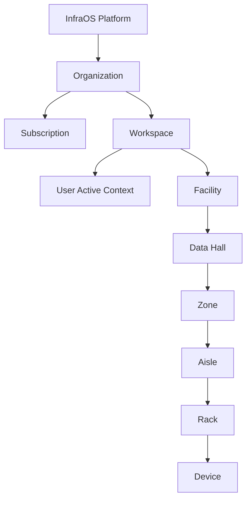

# InfraOS Tenant Hierarchy & Architecture

This document defines the structural relationships and operational context of the DesignDC (InfraOS) platform.

## 1. Tenant Hierarchy

The platform follows a strictly nested hierarchy, ensuring isolation and clean resource management.

### Hierarchy Definitions

| Level | Description | Key Identifier | Service |
| :--- | :--- | :--- | :--- |
| **Organization** | The primary billing and administrative unit. Owns subscriptions. | `org_id` | `infra-tenant` |
| **Workspace** | A logical grouping of infrastructure (e.g. "US-West Region"). | `workspace_id` | `infra-tenant` |
| **Logical Space** | A virtual "slice" of capacity within a workspace, assigned to specific users. | `logical_space_id` | `infra-tenant` |
| **Facility** | A physical building containing data halls. | `facility_id` | `infra-facility` |
| **Data Hall** | A room within a facility with dedicated power/cooling capacity. | `hall_id` | `infra-facility` |
| **Zone** | A partition within a hall (e.g. "Cold Aisle Containment Zone"). | `zone_id` | `infra-facility` |
| **Aisle** | A row of racks within a zone. | `aisle_id` | `infra-facility` |
| **Rack** | An enclosure for IT equipment, tracking U-space and power draw. | `rack_id` | `infra-rack` |
| **Device** | Individual IT assets (Servers, Switches, PDUs). | `device_id` | `infra-device` |

---

## 2. Feature Architecture (Recent Updates)

### A. Persistent Workspace Context (Phase 22)
The platform now implements "Stickiness" for the operational environment.
- **Backend**: The `users` table includes a `last_workspace_id`.
- **Sync**: When a user selects a workspace in the UI, the browser sends a `PATCH /auth/me` to the tenant service.
- **Restore**: On a new session (even from a different device), the app fetches the user profile and automatically restores the last active workspace, skipping the selector screen.

### B. Live Telemetry Aggregation
The Dashboard uses a high-performance aggregation layer to provide real-time insights.
- **Stream**: `infra-metrics-stream` exposes `/metrics/summary` by aggregating raw Prometheus data.
- **Gateway**: The `DataAggregator` fetchs this summary and combines it with alert counts from `infra-alert-engine`.
- **Dashboard**: Displays Grid Load (MW), Inlet Temp (°C), and Risk Factor (%) with sub-second latency.

### C. Global Security Handlers (401 Redirect)
To ensure system integrity, a global 401 interceptor was implemented:
- **Detection**: Any API call returning `401 Unauthorized` triggers an immediate local state cleanup.
- **Logout**: The `useAuthStore` resets all tokens and workspace IDs.
- **Redirect**: The user is immediately returned to the Login screen, preventing "Zombies sessions" from stale tokens.

---

## 3. Operational Flow

1. **Authentication**: User logs in -> Receives JWT + User Profile (including `last_workspace_id`).
2. **Context Resolution**: If `last_workspace_id` is present, jump to Dashboard. If not, show Workspace Selector.
3. **Orchestration**: Create resources following the hierarchy. Each request is automatically injected with `X-Tenant-Id` and `X-Workspace-Id` by the Gateway.
4. **Monitoring**: Dashboard continuously polls the Gateway's aggregated metrics for live feedback.
